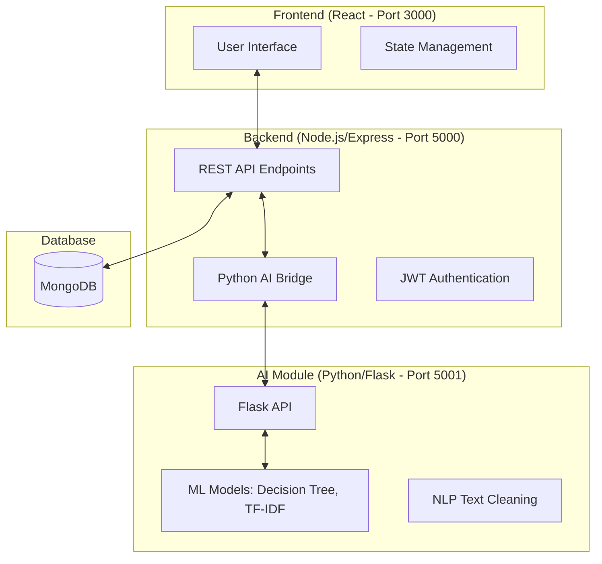
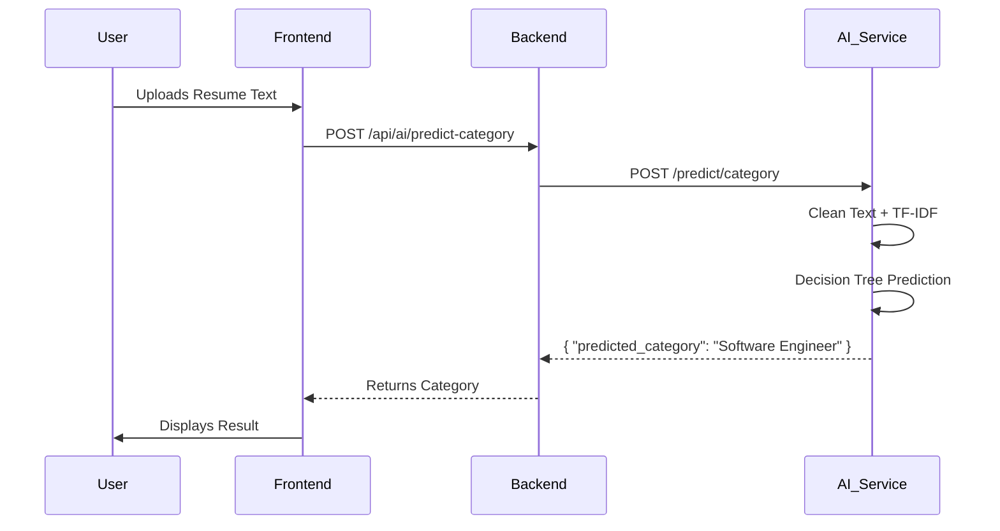
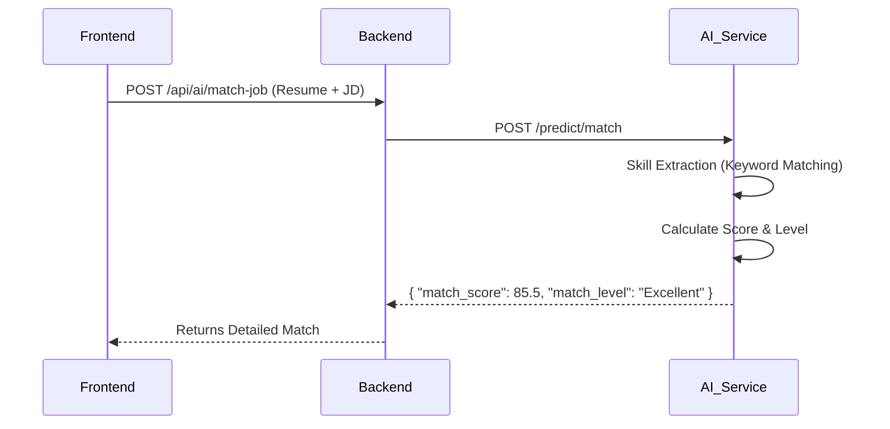

# Project Analysis: Job Assistant AI

This document provides a comprehensive technical overview of the **Job Assistant AI** project. It is designed to serve as a complete reference for any developer or AI agent tasked with maintaining, extending, or refactoring the codebase.

---

## 1. Project Mission & Core Functionality

**Job Assistant AI** is an end-to-end platform designed to automate and enhance the job application process. It leverages Machine Learning to:
-   **Classify Resumes**: Automatically determine the professional category of a resume.
-   **Calculate Match Scores**: Evaluate the compatibility between a user's resume and specific job descriptions.
-   **Provide Recommendations**: Suggest relevant jobs based on the user's skills and experience.
-   **Manage Applications**: Track job applications and their statuses in a centralized dashboard.

---

## 2. System Architecture

The project follows a **Decoupled Three-Tier Architecture**, consisting of a React frontend, a Node.js/Express backend, and a Python/Flask AI microservice.



---

## 3. Technology Stack

### Frontend
-   **Framework**: React.js
-   **Routing**: React Router DOM v6
-   **State Management**: React Hooks (useState, useEffect)
-   **API Client**: Axios / Fetch API

### Backend
-   **Runtime**: Node.js
-   **Framework**: Express.js
-   **Database**: MongoDB (via Mongoose)
-   **Authentication**: JWT (JSON Web Tokens) & Bcrypt.js
-   **Communication**: Axios (for AI Bridge)

### AI Module
-   **Language**: Python 3.x
-   **Framework**: Flask (API Layer)
-   **ML Libraries**: Scikit-learn, Pandas, NumPy
-   **NLP**: NLTK / Regex-based cleaning, TF-IDF Vectorization
-   **Serialization**: Joblib (for model persistence)

---

## 4. Directory Structure

```text
job-assistant/
├── ai-module/              # Python AI Microservice
├── backend/                # Node.js Backend
│   ├── config/             # DB and system configurations
│   ├── middleware/         # Auth and validation middleware
│   ├── models/             # Mongoose schemas (User, Application)
│   ├── routes/             # API route definitions
│   ├── utils/              # Helper functions (PythonBridge)
│   └── server.js           # Backend entry point
└── frontend/               # React Frontend
    ├── public/             # Static assets
    └── src/
        ├── components/     # Reusable UI components
        ├── pages/          # Page-level components (Dashboard, Login, etc.)
        ├── services/       # API interaction logic
        └── App.js          # Main application component
```

---

## 5. Database Schema (MongoDB/Mongoose)

### 5.1 User Model
- `name`: String (Full name)
- `email`: String (Unique, used for login)
- `password`: String (Hashed with Bcrypt)
- `skills`: Array of Strings
- `createdAt`: Date

### 5.2 Application Model
- `userId`: ObjectId (Reference to User)
- `company`: String
- `position`: String
- `status`: Enum ('applied', 'interview', 'offered', 'rejected')
- `date`: Date

---

## 6. Frontend Components & Pages

The frontend is structured into several key views:
-   **Dashboard**: Overview of current application statistics.
-   **Applications**: Detailed list of all tracked job applications.
-   **Job Matcher**: Interactive interface to compare a resume against a specific JD.
-   **Upload Resume**: Interface for submitting resume text for AI analysis.
-   **Profile**: User settings and skill management.
-   **Auth (Login/Register)**: Secured access to the platform.

---

## 7. Data Flow Diagrams

### 7.1 Resume Classification Flow


### 7.2 Job Matching Flow


---

## 8. AI & Machine Learning Details

### Model Pipeline
1.  **Text Cleaning**: Removes special characters, extra spaces, and converts to lowercase.
2.  **Vectorization**: Uses `TfidfVectorizer` to convert text into numerical features.
3.  **Classification**: Uses a `DecisionTreeClassifier` trained on a dataset of resumes and job categories.
4.  **Skill Extraction**: A rule-based system using a predefined list of `SKILL_KEYWORDS`.

### Key Model Artifacts (`ai-module/outputs/`)
-   `decision_tree_model.pkl`: The primary category classifier.
-   `tfidf_vectorizer.pkl`: The vectorizer used to transform input text.
-   `label_encoder.pkl`: Maps numerical predictions back to human-readable categories.

---

## 9. Key API Endpoints

### Backend (Port 5000)
| Endpoint | Method | Description | Auth Required |
| :--- | :--- | :--- | :--- |
| `/api/auth/register` | POST | Register new user | No |
| `/api/auth/login` | POST | Login and get JWT | No |
| `/api/ai/predict-category` | POST | Predict category from resume | Yes |
| `/api/ai/match-job` | POST | Match resume with JD | Yes |
| `/api/ai/recommendations` | GET | Get suggested jobs for user | Yes |

### AI Service (Port 5001)
| Endpoint | Method | Description |
| :--- | :--- | :--- |
| `/health` | GET | Check service status |
| `/predict/category` | POST | Classify resume text |
| `/predict/match` | POST | Calculate match score |
| `/predict/batch` | POST | Rank multiple jobs against a resume |

---

## 10. Development & Setup

### Prerequisites
-   Node.js & npm
-   Python 3.8+
-   MongoDB (running locally or URI)

### Setup Steps
1.  **Backend**: `cd backend && npm install`
2.  **Frontend**: `cd frontend && npm install`
3.  **AI Module**: `cd ai-module && pip install -r requirements.txt`
4.  **Training**: Run `python ai-module/scripts/03_train_model.py` to generate artifacts.

### Running the App
-   **AI Service**: `python ai-module/api/predict_api.py` (Starts on 5001)
-   **Backend**: `npm run dev` in `backend/` (Starts on 5000)
-   **Frontend**: `npm start` in `frontend/` (Starts on 3000)

---

## 11. Future Roadmap & Considerations
-   **Deep Learning Implementation**: Transition from Decision Trees to Transformer-based models (BERT).
-   **PDF/Docx Support**: Implement server-side parsing for resume files.
-   **Real-time Scraping**: Integrate a scraper for live job postings.
-   **Dockerization**: Containerize all three services for easier deployment.
