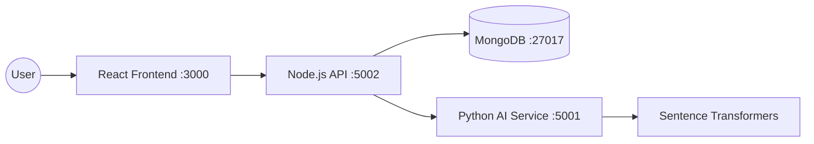

<p align="center">
  
  
  
  
  
  
</p>

# NextHireAI — AI-Powered Career Copilot

> **Production-Grade AI Career Platform** that transforms the job hunt experience.  
> Analyze resumes with Transformers AI → Get ATS scores → Match jobs semantically → Track applications in Kanban.

---

## 📑 Table of Contents

- [Quick Start](#-quick-start)
- [AI Engine (The Brain)](#-ai-engine-the-brain)
- [Tech Stack](#-tech-stack)
- [Project Structure](#-project-structure)
- [Architecture](#-architecture)
- [API Reference](#-api-reference)
- [Frontend Features](#-frontend-features)
- [Environment Variables](#-environment-variables)
- [Docker Deployment](#-docker-deployment)
- [Common Issues](#-common-issues)
- [GitHub Upload Guide](#-github-upload-guide)

---

## 🚀 Quick Start

### Prerequisites

| Tool | Version | Install |
|------|---------|---------|
| Docker | 20.10+ | [docker.com](https://www.docker.com/) |
| Node.js | 18+ | [nodejs.org](https://nodejs.org/) |
| Python | 3.10+ | [python.org](https://www.python.org/) |
| MongoDB | 6.0+ | `brew tap mongodb/brew` |

### 1. Clone & Setup

```bash
git clone https://github.com/YourUsername/NextHireAI.git
cd NextHireAI
```

### 2. Environment Configuration

```bash
# In the root or backend folder, create a .env file
MONGODB_URI=mongodb://localhost:27017/jobapp
JWT_SECRET=your_jwt_secret_key
AI_SERVICE_URL=http://localhost:5001
PORT=5002
```

### 3. Start with Docker (Easiest)

```bash
docker-compose up --build
```
> 🟢 **Frontend:** http://localhost:3000  
> 🟢 **Backend API:** http://localhost:5002  
> 🟢 **AI Microservice:** http://localhost:5001

---

## 🧠 AI Engine (The Brain)

NextHireAI has moved beyond keyword matching. It uses a **Semantic Deep Learning Engine**:

- **Model:** `sentence-transformers/all-MiniLM-L6-v2`
- **Resume Parsing:** Supports **PDF** and **DOCX** with deep section extraction (Skills, Experience, Education).
- **ATS Scoring:** Heuristic analysis of resume strength, formatting, and keyword density.
- **Semantic Matching:** Calculates Cosine Similarity between Resume Embeddings and Job Descriptions. It understands that "Java Developer" is related to "Backend Engineer" even without exact keyword matches.

---

## 🛠 Tech Stack

### AI Microservice
| Component | Technology |
|-----------|-----------|
| Language | Python 3.11 |
| Framework | Flask |
| ML Engine | Sentence-Transformers (BERT-based) |
| Parsing | pdfplumber, python-docx |

### Backend
| Component | Technology |
|-----------|-----------|
| Runtime | Node.js |
| Framework | Express.js |
| Database | MongoDB + Mongoose |
| Auth | JWT (JSON Web Tokens) |
| Security | bcryptjs, CORS |

### Frontend
| Component | Technology |
|-----------|-----------|
| Framework | React 18 |
| Styling | Tailwind CSS (v3) |
| UI | Glassmorphism Design System |
| Icons | Lucide / Emojis |
| HTTP | Axios |

---

## 📁 Project Structure

```
NextHireAI/
├── ai-module/                # 🐍 Python AI Microservice
│   ├── api/
│   │   ├── predict_api.py    # Flask entry point
│   │   ├── semantic_engine.py# AI Logic & BERT Embeddings
│   │   └── resume_parser.py  # PDF/DOCX Parsing logic
│   └── Dockerfile            # AI Container build
│
├── backend/                  # 🟢 Node.js Backend
│   ├── models/               # Mongoose Schemas (User, Resume, App)
│   ├── routes/               # API Endpoints
│   ├── middleware/           # Auth & Role guards
│   ├── utils/                # Python Bridge (Axios)
│   ├── server.js             # Entry point
│   └── Dockerfile            # Backend Container build
│
├── frontend/                 # ⚛️ React Frontend
│   ├── public/               # SEO & Static assets
│   ├── src/
│   │   ├── pages/            # Dashboard, Analyzer, Kanban, etc.
│   │   ├── components/       # UI Components
│   │   ├── services/         # API Service layer
│   │   └── App.css           # Tailwind Design Tokens
│   └── Dockerfile            # Frontend Production build
│
└── docker-compose.yml        # 🚀 Multi-container orchestration
```

---

## 🏗 Architecture



---

## 📡 API Reference

### 🔐 Authentication
- `POST /api/auth/register` - Create new user
- `POST /api/auth/login` - Get JWT token
- `GET /api/auth/profile` - Get user profile

### 📄 Resume Management
- `POST /api/resume/upload` - Save resume text to DB
- `GET /api/resume` - Get active resume
- `GET /api/resume/history` - List previous versions

### 🧠 AI Analysis
- `POST :5001/analyze/resume` - Full ATS & Skill analysis
- `POST :5001/match/semantic` - Semantic Job-Resume matching
- `POST :5001/career/paths` - Get AI career roadmap

---

## 📱 Frontend Features

- **Smart Dashboard:** Real-time stats, AI recommendations, and ATS score rings.
- **Resume Analyzer:** Paste text or upload to get instant "Strengths vs Weaknesses" feedback.
- **Semantic Matcher:** Compare your resume against any Job Description with a percentage match.
- **Kanban Tracker:** Professional "Drag-and-Drop" style tracking for applications (Applied → Interview → Offered).
- **Profile Hub:** Manage headlines, skills, and resume versioning.

---

## ⚙️ Environment Variables

Create a `.env` file in the `backend/` directory:

| Variable | Description | Default |
|----------|-------------|---------|
| `MONGODB_URI` | Connection string | `mongodb://localhost:27017/jobapp` |
| `JWT_SECRET` | Token secret | `nexthire_secret_key` |
| `AI_SERVICE_URL`| Microservice endpoint | `http://localhost:5001` |
| `PORT` | Backend port | `5002` |

---

## 🐳 Docker Deployment

To deploy the entire stack in one go:

```bash
docker-compose up --build
```

This starts:
1.  **MongoDB** (Database)
2.  **AI Microservice** (Python/BERT)
3.  **Backend API** (Node/Express)
4.  **Frontend** (React/Production build)

---

## ⚠️ Common Issues

- **Port 5000 Conflict:** If port 5000 is used by macOS, this project automatically uses **5002** for the backend.
- **AI Model Download:** On the first run, the AI module will download a ~100MB model. This might take a minute depending on your internet.
- **PDF Parsing:** Ensure your PDF is text-based (not scanned images) for the best extraction results.

---

## 📤 GitHub Upload Guide

To push this project to your GitHub account:

1.  **Create a Repository:** Go to GitHub and create a new repo named `NextHireAI`.
2.  **Initialize Git:**
    ```bash
    git init
    git add .
    git commit -m "feat: initial release of NextHireAI Career Copilot"
    ```
3.  **Link and Push:**
    ```bash
    git branch -M main
    git remote add origin https://github.com/YourUsername/NextHireAI.git
    git push -u origin main
    ```

---

<p align="center">
  Built with ❤️ for the future of recruitment by <strong>Raj Soni</strong>
</p>
